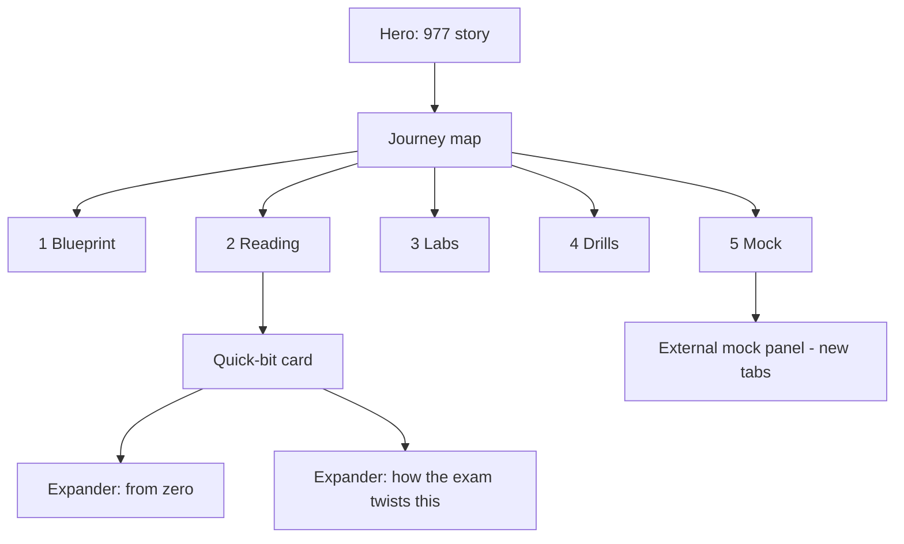

# CCA-F Interactive Guide - Plan

## Goal Capsule

* **Objective:** Ship v1 of a free, interactive web guide for the Claude Certified Architect – Foundations (CCA-F) exam, built around Sangam's 977/1000 pass experience and the open-source resource ecosystem.

* **Product authority:** This Product Contract. Sangam is the content authority — every exam-style question, blocker story, and adapted passage passes through his review before publishing.

* **Open blockers:** None for planning or the local build. The Vercel account/domain email transfer is owned by Sangam, runs in parallel, and gates only the final deployment step.

***

## Product Contract

### Summary

A Journey Map website where the five steps — blueprint, reading, labs, drills, mock exam — are the landing page, each opening into bite-sized layered concept cards with Sangam's exam-day insights woven in. Soothing reading-first UI; free, no login, progress kept in-browser. Built as local HTML first, then deployed on Vercel at a divingsbysangam.com subdomain and refreshed quarterly.

### Problem Frame

The CCA-F exam is new, and its \~25 community prep resources are almost all reading-heavy GitHub repos. A candidate faces three walls that Sangam hit personally: crossing from structured-platform thinking (Salesforce, classic cloud) into agent-native architecture; internalizing unfamiliar terminology and the limitations that matter in practice; and finding trustworthy sources at all. The sharpest gap is exam style: questions are analogy-framed — the concept under test is never named, and all four options sit deliberately close — so recall-style prep leaves candidates surprised on exam day. Existing repos document facts; none train recognition, and none walk a learner through an ordered path from blueprint to booking the exam.

### Key Decisions

* **Layered quick bits over two audience tracks.** One card set serves non-technical and engineer audiences via optional expanders, without doubling authoring and every quarterly update. (session-settled: user-approved — chosen over two separate tracks: same coverage at roughly half the build and maintenance cost.) Governs R2.

* **Journey Map landing over exam-first or narrative entry.** The five steps are the page; calm clarity beats a diagnostic hook. (session-settled: user-directed — chosen over a diagnostic-first entry and a story-timeline shape after a visual comparison of all three.) Governs R1.

* **No login; browser-local progress with export/import.** (session-settled: user-approved — chosen over Google OAuth plus a database: login without server-side sync adds friction, a Google Cloud project, and a privacy burden while changing nothing about how progress is saved.) Governs R13.

* **Living guide with quarterly refresh over timeless snapshot.** (session-settled: user-directed — chosen over a one-time publication: a brand flagship cannot go stale against a fast-moving exam.) Governs R15.

* **External mock exams linked, not rebuilt.** A small original sample set demonstrates exam feel; full-length mocks are curated outbound links. (session-settled: user-directed — chosen over authoring a complete in-guide mock exam: reuses the ecosystem and keeps authoring focused on understanding.) Governs R9.

* **Original and openly licensed content only.** Adapt CC BY 4.0 / MIT sources with attribution; generate original questions from the official blueprint. (user-approved — chosen over pulling from third-party question banks: republishing their content is copyright infringement and could take the guide down.) Governs R6, R8, R10.

* **Five-step ordering as the spine.** Blueprint → reading → labs → drills → mock exam. (session-settled: user-approved.) Governs R1, R5–R9.

### Actors

* A1. **Platform-crosser** — professional from a structured platform background (Salesforce, AWS-style cloud) new to agent-native architecture; uses the "from zero" expanders.

* A2. **Engineer** — already builds software; reads quick bits at face value and skips expanders.

* A3. **Maintainer (Sangam)** — reviews all content pre-publish and runs the quarterly refresh.

### Requirements

**Experience and structure**

* R1. The landing page presents the five-step journey map with per-step progress; any step's content is reachable in one click.

* R2. Every concept is a quick-bit card readable in about two minutes, with two optional expanders: "from zero" (plain-language explanation with a familiar-platform analogy) and "how the exam twists this."

* R3. A hero section carries Sangam's 977 journey in brief; his three blockers appear as waypoint callouts inside the steps they belong to.

* R4. The reading experience is calm and gate-free: no login wall, popups, or ads; a first-time visitor is reading content within seconds of landing.

* R16. A subtle ambient particle layer is the guide's visual identity: slow drifting background particles, journey-path sparks between steps, and gentle bursts on completion — always behind the content, slow-moving, and never obstructing text (reference: `demos/guide-particles-preview.html`).

* R17. The hero shows a "Continue" resume button once progress exists. (The glossary/quick-reference page and footer references row originally in R17 were cut 2026-08-15 as v1 overkill — user decision.)

**Content (the five steps)**

* R5. Blueprint step: exam structure, the five domains with weights, logistics, and links to the official exam guide and blueprint; external links open in a new tab.

* R6. Reading step: quick-bit cards across all five domains, mixing original writing with passages adapted from openly licensed sources; every adapted source gets visible attribution and a credits section entry.

* R7. Labs step: guided "build it yourself" missions for Claude Code (each with a goal, an outline, and a self-check), reflecting that hands-on judgment is what the exam actually tests — no embedded execution environment.

* R8. Drills step: original exam-style questions — analogy-framed scenarios with four deliberately close options — where each option's explanation teaches how to recognize the disguised concept.

* R9. Mock step: a small set of original sample questions to set expectations, then a curated panel of external mock exams, each with a one-line "what this one is good for" note, opening in new tabs.

* R10. No content from NDA-covered or proprietary sources anywhere; original questions are inspired by exam style, never reproduced from the exam.

**Progress**

* R13. Progress — cards read, steps completed, drill scores — lives in browser storage. (The ambient features — R11 Spotify widget, R12 study timer, and the export/import half of R13 — were all cut 2026-08-14/15 as v1 overkill — user decision; progress is single-browser.)

**Distribution and maintenance**

* R14. The guide builds and runs as local static HTML files, deploys to Vercel unchanged, and is served at a divingsbysangam.com subdomain.

* R15. A quarterly refresh workflow: a maintainer checklist (blueprint deltas, link rot, model and feature changes) and a visible "last verified" date in the guide.

### Key Flows

* F1. **First visit**

  * **Trigger:** Learner lands on the guide.

  * **Steps:** Hero story → journey map → opens Blueprint → reads cards, marking progress as they go; music available but inert until touched.

  * **Covers:** R1–R5, R11.

* F2. **Device move**

  * **Trigger:** Learner switches browser or machine.

  * **Steps:** Export progress file on the old device → import on the new one → map and scores restore.

  * **Covers:** R13.

* F3. **Quarterly refresh**

  * **Trigger:** Quarter boundary or a major Anthropic release.

  * **Steps:** Maintainer runs the checklist → updates affected cards, drills, and links → bumps the "last verified" date → redeploys.

  * **Covers:** R15.

### Acceptance Examples

* AE1. **Covers R2.** Given a quick-bit card, when the learner expands "from zero," a plain-language explanation with a familiar-platform analogy appears; both expanders are collapsed by default.

* AE2. **Covers R8.** Given a drill question, when the learner picks a wrong option, the explanation names why that option is tempting and what distinguishes the correct one — not just which is right.

* AE3. **Covers R9, R13.** Given the external mock panel, when a link is clicked, it opens in a new tab and the guide's own state is unchanged on return.

* AE4. Removed 2026-08-14 with the export/import cut.

* AE5. **Covers R11.** Given a fresh page load, no audio plays and no Spotify request fires until the learner interacts with the music widget.

### Success Criteria

* A candidate can go from landing to exam-ready using only the guide's five steps and its curated outbound links — no need to discover the source repos independently.

* The experience reads as calm and polished enough to serve as a flagship of the divingsbysangam.com brand.

* The "last verified" date is never older than four months once live.

### Scope Boundaries

**Deferred for later**

* CCA-P (Professional) tier content.

* The exam-first diagnostic pulse-check inside Drills (v1.1 candidate).

* Accounts and cross-device sync.

* Embedded interactive labs or code execution.

* Community features (comments, discussion, leaderboards).

**Outside this product's identity**

* A course or curriculum platform — the guide is a map with quick bits, not lessons.

* Republishing third-party question banks in any form.

* A general Claude tutorial site — everything stays exam-focused.

### Dependencies / Assumptions

* Sangam owns the Vercel account / domain email transfer, in parallel; it gates deployment only, never the local build.

* Sangam supplies the Spotify playlist, the subdomain name, and review of all content — especially exam-style questions and blocker stories.

* Assumption (verify at build time): a Spotify playlist iframe embed plays without any site-side authentication — full tracks for logged-in Spotify visitors, previews otherwise.

* Licenses as verified 2026-08-10: daronyondem/claude-architect-exam-guide is CC BY 4.0; hamzafarooq/claude-certified-architect is MIT. Re-verify each source's license at adaptation time.

### Outstanding Questions

**Deferred to Planning**

* Guide name and title treatment (working name: "CCA-F Interactive Guide").

* Subdomain choice (candidates: ccaf. or guide. on divingsbysangam.com).

* Static-site approach: hand-rolled HTML versus a lightweight static framework.

* Concept-card inventory per domain (content pass against the blueprint's weights).

* Timer style: plain countdown versus Pomodoro presets.

### Sources / Research

* [CCA-F-Open-Source-Resources.md](../../CCA-F-Open-Source-Resources.md) — the full annotated inventory of \~25 open-source guides, mock exams, courses, and official pages this guide curates and links out to.

* Official exam pages (Anthropic Academy / Skilljar) — exam guide PDF, blueprint, domain weights.

* Sangam's exam experience (this session's dialogue): analogy-framed questions with four close options; hands-on judgment over recall; three prep blockers — platform-crossing mindset, terminology and limitations, source scarcity.